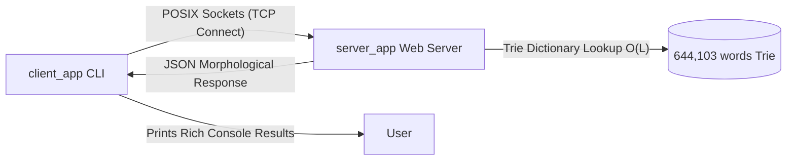

# 🔌 Nova Sovereign Native Client App

Welcome to the native CLI client written entirely in **Zenith (`.zn`)** and compiled down to a bare-metal native binary! 

This application connects directly to our custom **Zenith HTTP Server** on port `9500` using POSIX socket sockets, queries words interactively, and formats the morphological analysis instantly in your terminal!

---

## 🏗️ Architecture & Flow



---

## 🚀 How to Run the Client-Server Ecosystem

Because our agent sandbox blocks local binding, both apps can be executed on **your actual host Mac** where they will communicate perfectly!

### Step 1: Start the Web Server (In Terminal 1)
```bash
cd "/Users/os2026/Downloads/novaRoad 2/nova/src/native/bootstrap"
./build/server_app
```

### Step 2: Start the CLI Client (In Terminal 2)
```bash
cd "/Users/os2026/Downloads/novaRoad 2/nova/src/native/bootstrap"
./build/client_app
```

---

## 💡 Example Interactive Session

Once you start `./build/client_app`, you can enter words and see them synthesized in real-time:

```ansi
╔══════════════════════════════════════════════════════════╗
║    Nova Sovereign HTTP Client Engine v1.0               ║
║    Written in Zenith (.zn) — Native CLI Client          ║
╚══════════════════════════════════════════════════════════╝


👉 Enter a Turkish word (or 'q' to quit): bilimsel
🔌 Connecting to Zenith HTTP server on http://localhost:9500...
📤 Sending GET request for word analysis...
📥 Receiving response from native server...

✨ --- SOVEREIGN ANALYSIS RESULT ---
{"root":"bilim","translation":"science","suffix":"+sel/sal","desc":"Derivative suffix denoting association (related to/scientific)","type":"derivative","synth":"related to bilim; scientific (science)"}
━━━━━━━━━━━━━━━━━━━━━━━━━━━━━━━━━━━━
```

Press `q` to quit the client loop cleanly.
