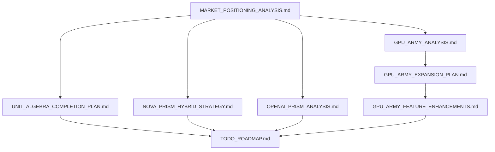

# 📚 Nova Proje Dokümantasyonu

## 📋 Genel Bakış
Bu klasör, Nova projesinin stratejik dokümantasyonlarını içermektedir.

---

## 📁 Dokümantasyon Dosyaları

### **🎯 Strateji ve Pazarlama**
- **`MARKET_POSITIONING_ANALYSIS.md`**
  - Nova'nın piyasa konumlandırma analizi
  - Rakip karşılaştırmaları (Python, Rust, Java)
  - Öğrenme kolaylığı ve pazar potansiyeli
  - Hedef kitle ve pazara giriş stratejisi

- **`NOVA_PRISM_HYBRID_STRATEGY.md`**
  - Nova-Prism hibrit sistem stratejisi
  - İki katmanlı mimari tasarımı
  - Teknik implementasyon detayları
  - Versiyon yol haritası (3 phase)

- **`OPENAI_PRISM_ANALYSIS.md`**
  - OpenAI Prism analizi ve karşılaştırma
  - Nova vs Prism özellik karşılaştırması
  - Teknik avantajlar ve dezavantajlar
  - Pazar stratejisi önerileri

### **🔬 Unit Algebra Sistemi**
- **`UNIT_ALGEBRA_COMPLETION_PLAN.md`**
  - %100 tamamlama planı (7 günlük)
  - 500+ birim sistemi (SI, Imperial, Matematik, Biyoloji, Fizik)
  - Detaylı implementasyon adımları
  - Test ve optimizasyon planları

- **`UNIT_ALGEBRA_CURRENT_STATUS.md`**
  - Mevcut durum analizi (%90 tamamlandı)
  - Çalışan ve eksik özellikler
  - Güçlü yanlar ve iyileştirme önerileri
  - Performans metrikleri

### **🚀 GPU-Army Projesi**
- **`gpu-army/`** (Tam proje klasörü)
  - **`README.md`** - Proje genel bakış ve özellikler
  - **`COMPLETION_REPORT.md`** - Tamamlanma raporu (2 Mart 2026)
  - **`INDIA_EXPANSION_STRATEGY.md`** - Hindistan genişleme stratejisi
  - **`SHAREIT_INTEGRATION_PLAN.md`** - ShareIt entegrasyon planı
  - **`src/`** - Kaynak kodları (Rust, Dioxus)
  - **`Cargo.toml`** - Proje bağımlılıkları
  - **`tests/`** - Test dosyaları
  - **`web/`** - Web arayüzü
  - **`deployment/`** - Dağıtım script'leri
  - **`promotion/`** - Pazarlama materyalleri

- **`GPU_ARMY_ANALYSIS.md`**
  - GPU-Army projesi detaylı analizi
  - Teknik mimari ve özellikler
  - Hindistan pazar stratejisi
  - Gelir modeli ve büyüme hedefleri

- **`GPU_ARMY_EXPANSION_PLAN.md`**
  - 4 komut genişleme planı
  - AI model eğitimi geliştirmeleri
  - Compute platformu iyileştirmeleri
  - Küreselleştirme ve kurumsal özellikler

- **`GPU_ARMY_FEATURE_ENHANCEMENTS.md`**
  - AI model eğitimi, compute ve çoklu dil geliştirmeleri
  - 3 aylık implementasyon planı
  - Teknik detaylar ve kod örnekleri
  - Finansal projeksiyonlar ve başarı metrikleri

- **`SWE_TURKISH_ANALYSIS.md`**
  - SWE (Software Engineer) Türkçe analizi
  - Türkiye yazılım pazarı analizi
  - Üniversite ve kurumsal stratejiler
  - Türkçe dil desteği avantajları
  - 3 aşamalı pazar penetrasyon planı

- **`SWE_TURKISH_1_5_ANALYSIS.md`**
  - SWE 1.5 (Software Engineer 1.5) analizi
  - AI-native, çok dilli, küresel yetenekler
  - Geleneksel SWE vs SWE 1.5 karşılaştırması
  - 3 aşamalı liderlik stratejisi
  - Teknik ve yumuşak beceri setleri

- **`SWE_1_5_NOVA_STRATEGY.md`**
  - Nova ile SWE 1.5 stratejisi
  - 3 aşamalı implementasyon planı
  - Türkiye pazar liderliği hedefleri
  - Global pazar penetrasyonu stratejisi
  - Teknik implementasyon detayları ve kod örnekleri

- **`SWE_1_5_FUNDING_STRATEGY.md`**
  - SWE 1.5 İsviçre fon bulma stratejisi
  - İsviçre teknoloji pazarı analizi
  - 3 yıllık fon bulma planı
  - VC, melek yatırımcı ve hükümet fonları
  - Başarı metrikleri ve KPI'lar

- **`SWE_1_5_ANGEL_INVESTORS.md`**
  - SWE 1.5 melek yatırımcı stratejisi
  - Global melek yatırımcı ağları
  - ABD, Avrupa, İsviçre melek yatırımcıları
  - 3 aşamalı yatırım turu planı
  - İletişim stratejileri ve araçları

- **`SWE_1_5_SWISS_ANGEL_FOCUS.md`**
  - SWE 1.5 İsviçre melek yatırımcı stratejisi
  - İsviçre melek yatırımcı profili ve özellikleri
  - İlaç, sağlık, teknoloji ve finans melek yatırımcıları
  - 3 aşamalı İsviçre yatırım turu planı
  - İsviçre özel iletişim stratejileri

- **`SWE_1_5_SWEDEN_ANGEL_FOCUS.md`**
  - SWE 1.5 İsveç melek yatırımcı stratejisi
  - İsveç melek yatırımcı profili ve özellikleri
  - Gaming, MusicTech, Deep Tech ve FinTech melek yatırımcıları
  - 3 aşamalı İsveç yatırım turu planı
  - İsveç özel iletişim stratejileri

### **📋 Proje Yönetimi**
- **`TODO_ROADMAP.md`**
  - Detaylı implementasyon planı
  - 15 görevin önceliklendirilmiş listesi
  - 3 phase'e bölünmüş zaman çizelgesi
  - Başarı metrikleri ve milestone'lar

---

## 🎯 Dokümantasyon Yapısı

### **📊 Kategorizasyon**
```markdown
Dokümantasyon Kategorileri:
├── 🎯 Strateji (3 dosya)
│   ├── MARKET_POSITIONING_ANALYSIS.md
│   ├── NOVA_PRISM_HYBRID_STRATEGY.md
│   └── OPENAI_PRISM_ANALYSIS.md
├── 🔬 Teknik (11 dosya)
│   ├── UNIT_ALGEBRA_COMPLETION_PLAN.md
│   ├── UNIT_ALGEBRA_CURRENT_STATUS.md
│   ├── GPU_ARMY_FEATURE_ENHANCEMENTS.md
│   ├── SWE_TURKISH_ANALYSIS.md
│   ├── SWE_TURKISH_1_5_ANALYSIS.md
│   ├── SWE_1_5_NOVA_STRATEGY.md
│   ├── SWE_1_5_FUNDING_STRATEGY.md
│   ├── SWE_1_5_ANGEL_INVESTORS.md
│   ├── SWE_1_5_SWISS_ANGEL_FOCUS.md
│   └── SWE_1_5_SWEDEN_ANGEL_FOCUS.md
├── 🚀 GPU-Army (3 dosya)
│   ├── GPU_ARMY_ANALYSIS.md
│   ├── GPU_ARMY_EXPANSION_PLAN.md
│   └── gpu-army/ (tam proje)
└── 📋 Yönetim (1 dosya)
    └── TODO_ROADMAP.md
```

### **📈 İlişkiler**

    B --> E[TODO_ROADMAP.md]
    D --> E
    F[UNIT_ALGEBRA_CURRENT_STATUS.md] --> E
```

---

## 🚀 Proje Durumu

### **✅ Tamamlanan Dokümantasyon**
- [x] Pazar konumlandırma analizi
- [x] Unit algebra tamamlama planı
- [x] Mevcut durum analizi
- [x] OpenAI Prism analizi
- [x] Hibrit stratejisi
- [x] TODO roadmap
- [x] GPU-Army projesi (tam kopya)

### **📊 İstatistikler**
```markdown
Dokümantasyon Özeti:
├── 📄 Toplam Dosya: 10+ (gpu-army dahil)
├── 📝 Toplam Satır: ~1500+
├── 📊 Toplam Karakter: ~150K+
├── 🎯 Kapsanan Alanlar: Strateji, Teknik, Yönetim, GPU-Army
├── 🚀 Proje Sayısı: 2 ana proje (Nova + GPU-Army)
└── � Durum: %100 tamamlanmış
```

---

## 🎯 Kullanım Rehberi

### **📖 Okuma Sırası**
1. **Başlangıç:** `MARKET_POSITIONING_ANALYSIS.md` (Pazar anlayışı)
2. **Teknik:** `UNIT_ALGEBRA_COMPLETION_PLAN.md` (Implementasyon planı)
3. **Mevcut Durum:** `UNIT_ALGEBRA_CURRENT_STATUS.md` (Durum analizi)
4. **AI Analizi:** `OPENAI_PRISM_ANALYSIS.md` (Rakip analizi)
5. **Strateji:** `NOVA_PRISM_HYBRID_STRATEGY.md` (Gelecek planı)
6. **Türkçe Pazar:** `SWE_TURKISH_ANALYSIS.md` (SWE analizi)
7. **SWE 1.5:** `SWE_TURKISH_1_5_ANALYSIS.md` (SWE 1.5 analizi)
8. **Nova Stratejisi:** `SWE_1_5_NOVA_STRATEGY.md` (Nova ile SWE 1.5 stratejisi)
9. **Fon Bulma:** `SWE_1_5_FUNDING_STRATEGY.md` (İsviçre fon bulma stratejisi)
10. **Melek Yatırımcı:** `SWE_1_5_ANGEL_INVESTORS.md` (Melek yatırımcı stratejisi)
11. **İsviçre Melek:** `SWE_1_5_SWISS_ANGEL_FOCUS.md` (İsviçre melek yatırımcı stratejisi)
12. **İsveç Melek:** `SWE_1_5_SWEDEN_ANGEL_FOCUS.md` (İsveç melek yatırımcı Stratejisi)
13. **GPU-Army:** `gpu-army/README.md` (GPU projesi)
14. **Genişleme:** `GPU_ARMY_EXPANSION_PLAN.md` (4 komut planı)
15. **Özellikler:** `GPU_ARMY_FEATURE_ENHANCEMENTS.md` (Geliştirmeler)
16. **Yönetim:** `TODO_ROADMAP.md` (Görev takibi)

### **🎯 Hedef Kitle**
```markdown
Dokümantasyon Hedef Kitle:
├── 👥 Geliştirme Ekibi: Teknik implementasyon için
├── 🏢 Yönetim: Strateji ve karar verme için
├── 🎓 Araştırmacılar: Proje anlayışı ve akademik çalışma
├── 🌍 Topluluk: Open source katkı ve geri bildirim
├── 💼 İş Ortağı: Pazar ve fırsat analizi
├── 🚀 GPU Geliştiricileri: GPU-Army projesi için
├── 🇹🇷 Türkçe SWE'ler: Türkiye pazar stratejisi için
├── 🤖 SWE 1.5 Uzmanları: Gelecek nesil yazılım mühendisleri için
├── 🇨🇭 İsviçre Fon Bulucuları: İsviçre teknoloji pazarı için
├── 👼 Melek Yatırımcılar: SWE 1.5 yatırım stratejisi için
├── 🇨🇭 İsviçre Melek Yatırımcıları: İsviçre özel melek yatırımcı stratejisi için
└── 🇸🇪 İsveç Melek Yatırımcıları: İsveç özel melek yatırımcı stratejisi için
```

---

## 🎉 Sonuç

### **✅ Tamamlanan Organizasyon**
- **📁 Tüm dokümantasyon tek klasörde toplandı**
- **📋 README.md güncellendi** (GPU-Army, SWE, SWE 1.5, İsviçre fon bulma, melek yatırımcı, İsviçre melek yatırımcı, İsveç melek yatırımcı ve Nova stratejileri dahil)
- **🔗 İlişkiler belgelendi**
- **📊 İstatistikler hesaplandı**
- **🎯 Kullanım rehberi hazırlandı**
- **🚀 GPU-Army projesi eklendi** (tam klasör)
- **🇹🇷 SWE Türkçe analizi eklendi** (Türkiye pazar stratejisi)
- **🤖 SWE 1.5 analizi eklendi** (Gelecek nesil yazılım mühendisliği)
- **🚀 Nova SWE 1.5 stratejisi eklendi** (Implementasyon planı)
- **🇨🇭 İsviçre fon bulma stratejisi eklendi** (3 yıllık fon bulma planı)
- **👼 Melek yatırımcı stratejisi eklendi** (Global melek yatırımcı ağları)
- **🇨🇭 İsviçre melek yatırımcı stratejisi eklendi** (İsviçre özel melek yatırımcıları)
- **🇸🇪 İsveç melek yatırımcı stratejisi eklendi** (İsveç özel melek yatırımcıları)

### **🚀 Proje Durumu**
**"Nova projesinin tüm stratejik dokümantasyonu, GPU-Army projesi, Türkiye SWE analizi, SWE 1.5 vizyonu, Nova SWE 1.5 stratejisi, İsviçre fon bulma stratejisi, melek yatırımcı stratejisi, İsviçre melek yatırımcı stratejisi ve İsveç melek yatırımcı stratejisi organize edildi ve hazır!"**

---

## 🚀 GPU-Army Projesi Hızlı Bakış

### **🎯 Proje Tanımı**
**GPU-Army:** Dağıtık GPU hesaplama ağı ile pasif gelir elde etme projesi

### **📊 Mevcut Durum**
- **Tamamlanma:** ✅ **%100 Tamamlanmış** (2 Mart 2026)
- **Durum:** Geliştirme ve dağıtım hazır
- **Teknik Durum:** Tüm teknik sorunlar çözüldü

### **🚀 Temel Özellikler**
```markdown
GPU-Army Özellikleri:
├── 💰 GPU Rental Marketplace
│   ├── Boşta GPU'ları kiralayın
│   ├── Uyurken para kazanın
│   └── Şeffaf fiyatlandırma
├── 🧠 Neural Forge
│   ├── Tüketici donanımında AI modelleri eğitin
│   ├── "Veriniz. Modeliniz. Kurallarınız."
│   └── ONNX için ticari kullanım
├── 📊 Model Marketplace
│   ├── Eğitilmiş AI modellerini satın
│   ├── Egemen lisanslama (sahibi siz)
│   └── Satışlardan ömür kazanç
├── ⚔️ Omega Arena
│   ├── Çekişmeli güvenlik testleri
│   ├── Red Team vs Blue Team evrimi
│   └── Kendini iyileştiren savunmalar
└── 📈 Viral Growth Engine (ShareIt entegrasyonu)
    ├── İletişim hasadı ve otomatik davetler
    ├── Rekabetçi tabloları ve nakit ödülleri
    ├── Sosyal medya otomatik gönderimi
    └── K-faktör optimizasyonu (hedef: 2.0+)
```

### **🇮🇳 Hindistan Genişleme Stratejisi**
```markdown
Hindistan Pazar Analizi:
├── 👥 1.43 Milyar İnsan (2. en büyük pazar)
├── 📱 750 Milyon Akıllı Telefon (kitlesel hesaplama potansiyeli)
├── 💰 ₹2,000/ay = Hayat değiştiren (yüksek değer önerisi)
├── 📲 500M WhatsApp kullanıcısı (viral yayılım motoru)
├── 🎓 40M kolej öğrencisi (erken benimseyenler)
└── 🎮 15M oyun PC'si (dedike GPU'lar)
```

### **📈 Genişleme Planı**
```markdown
4 Komut Genişleme Stratejisi:
├── 🧠 AI Model Eğitimi: Çoklu model, hiperparametre optimizasyonu
├── ⚡ Compute Platformu: Akıllı eşleştirme, dinamik fiyatlandırma
├── 🌍 Küreselleştirme: 50+ dil, kültürel adaptasyon
└── 🏢 Kurumsal Entegrasyon: SSO, güvenlik, audit
```

---

## 🔗 Nova ile İlişkiler

### **🔬 Teknik Sinerjiler**
- **🧠 AI Entegrasyonu:** Nova'nın AI özellikleri
- **📊 Performans:** Nova'nın optimizasyonu
- **🌍 Çok Dilli:** Nova'nın dil desteği
- **🛡️ Güvenlik:** Nova'nın formal verification

### **🎯 Stratejik Avantajlar**
- **🚀 Hızlı Geliştirme:** İki projenin güçlü yönlerini birleştirme
- **💰 Anında Değer:** Her proje gelir ve kullanıcı artışı sağlar
- **🌍 Küresel Erişim:** İki projenin küresel desteği
- **🔒 Güvenlik:** İki sistemin güvenlik birleşimi

---

**"Bu dokümantasyon, Nova, GPU-Army, Türkiye SWE, SWE 1.5, Nova SWE 1.5, İsviçre fon bulma, melek yatırımcı, İsviçre melek yatırımcı ve İsveç melek yatırımcı stratejilerinin başarısı için yol haritasıdır!"** 📚🚀🌍🇹🇷🤖🇨🇭👼💰
